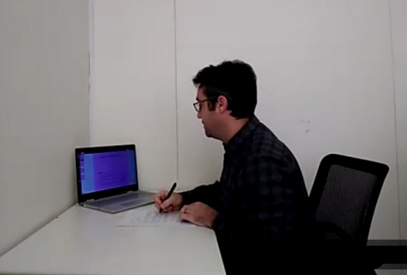

  <h4 class="alert-heading">Quick links</h4>
  <ul>
    <li> <a href="https://exams.math.buffalo.edu/zoom"> exams.math.buffalo.edu/zoom</a> - portal for accessing exam Zoom
      meeings (from phone/tablet).</li>
    <li> <a href="https://exams.math.buffalo.edu"> exams.math.buffalo.edu</a> - portal for accessing exam problems (from
      a computer).</li>
    <li> <a href="https://gradescope.com"> www.gradescope.com</a> - Gradescope.</li>
  </ul>

 
 

## 2-device proctored exams

This guide provides instructions for taking proctored exams in courses offered by the UB Math Department. The setup of
the exam requires students to use two devices:

* a computer, to access the exam
* a smartphone or tablet equipped with a camera to access an exam Zoom meeting.

Math Department staff members proctor the exams via students' smartphone/tablet cameras.

 

## Software installation and setup

  

    

      <h4> Zoom app</h4>

      
In order to join a proctored exam meeting you will need to have the <b>Zoom app</b> installed on your
        smartphone or tablet. This app is available for both
        <a target="_blank"
          href="https://play.google.com/store/apps/details?id=us.zoom.videomeetings&hl=en_US">Android</a>
        and <a target="_blank" href="https://apps.apple.com/us/app/zoom-cloud-meetings/id546505307">iOS</a>devices.
      

      
To access exam Zoom meetings you need to be signed into Zoom with your UB account. If you are signed in with
        another account, you can follow these steps to switch to your UB account:
      <ul>
        <li>In the Zoom app, sign out from the non-UB account (go to Settings > My Profile, then scroll down to the
          bottom).</li>
        <li>Click Sign In and then choose <b>SSO</b> where it says <em>SIGN IN WITH</em>.</li>
        <li>Type <code>buffalo</code> where it says <em>Enter your company domain</em>.</li>
        <li>On the next screen log in using your UB username and password (Duo will be required for this step).</li>
      </ul>
      Here is a <a target="_blank"
        href="https://ub.hosted.panopto.com/Panopto/Pages/Viewer.aspx?id=d26e3813-f3d1-4ed7-bae5-ac50012bc2e9">short
        video</a> demonstrating the above steps.
      

    

  

  

    

      <h4>Microsoft Office Lens</h4>

      
At the conclusion of the exam you will need to scan pages with your solutions using your phone or tablet, and
        save the
        scan as a PDF file.
        Install the <b>Microsoft Office Lens</b> scanning app on your smartphone or tablet. The app is available for
        both
        [Android] <a target="_blank"
          href="https://play.google.com/store/apps/details?id=com.microsoft.office.officelens">Android</a>)
        <a target="_blank" href="https://apps.apple.com/us/app/office-lens/id975925059">iOS</a> devices.
        If needed, refer to the online instructions on how to use Office Lens on
        <a target="_blank"
          href="https://support.office.com/en-us/article/microsoft-office-lens-for-android-ec124207-0049-4201-afaf-b5874a8e6f2b">Android</a>
        and <a target="_blank"
          href="https://support.microsoft.com/en-us/office/microsoft-office-lens-for-ios-fbdca5f4-1b1b-4391-a931-dc1c2582397b?ui=en-us&rs=en-us&ad=us">iOS</a>.
        Practice using this app to create PDF files, in particular learn how to create PDFs consisting on multiple
        pages.
        Here is a <a target="_blank"
          href="https://ub.hosted.panopto.com/Panopto/Pages/Viewer.aspx?id=4a00ab5c-ff3a-4c23-bc7d-ac5b0149a8bf">short
          video</a>
        demonstrating the use of Office Lens.

    

  

  

    

      <h4>Gradescope</h4>
      
Gradescope is where you will be submitting the exam for grading, (and also where you will go to see your
        score once the
        exam is graded).
      <ul>
        <li>Set up your Gradescope account following the instructions in this <a target="_blank"
            href="https://www.ubgradescope.info">guide to
            Gradescope</a>.</li>
        <li>Practice uploading to Gradescope. Your course instructor will likely give you a brief assignment for
          practice.
          Make sure you match each page of the file you upload to Gradescope with the appropriate question number.
        </li>
      </ul>
      Here is a <a target="_blank"
        href="https://ub.hosted.panopto.com/Panopto/Pages/Viewer.aspx?id=1150706c-3572-452e-b34f-ac5b0149af2f">short
        video</a>
      demonstrating the process of uploading your work to Gradescope and matching pages with questions.
      

    

  

#### The exam PIN

To access the proctored Zoom meeting and the exam questions you will need the exam PIN. You received the PIN in an email
from
prof. John Ringland (ringland@buffalo.edu) which was sent on September 10. A few days before the exam make sure that you
have the PIN.
If you can’t find it, contact the course instructor. For each math course you are taking this semester, you will use the
same PIN for all exams. 

  <b>important.</b> Keep the exam PIN private. Sharing it with other persons will be considered as an act of Academic
  Dishonesty.
  It can also implicate you in acts of dishonesty committed by others.

 

## Your exam workspace

  

    

      
Your exam workspace should be in a quiet location with no one else around. Remember: this is an exam, you will
        need to concentrate!

      
During the exam, you are <b>not allowed</b> to use any calculators or consult any references (e.g. cheat
        sheets, formula sheets, note cards,
        textbooks, websites, etc) unless it is specified otherwise by the course instructor. Also, you must not wear
        headphones or earbuds.
        Here is a <a target="_blank"
          href="https://ub.hosted.panopto.com/Panopto/Pages/Viewer.aspx?id=e79dfaad-6f77-4f01-8b14-ac51003e3efe">short
          video</a>
        demonstrating proper workspace setup. 

    

    

      

        <h5 class="alert-heading">Here is what you will need to take the exam:</h5>
        <ol>
          <li>A computer with an internet connection.</li>
          <li>A smartphone or tablet with an internet connection, and with Zoom and Office Lens apps installed.
            Make sure that your device is fully charged or it is connected to a charger.</li>
          <li>A Gradescope account.</li>
          <li>UB student ID (or a government issued photo ID).</li>
          <li>Your exam PIN.</li>
          <li>Pen or pencil.</li>
          <li>Blank paper.</li>
          <li>Desk or table clear of any items, besides those listed above.</li>
        </ol>
      

    

  

  

    

      

        <h4>Zoom device setup</h4>
        
Your Zoom device must use the front-facing (selfie) camera for the Zoom meeting (so that the screen is facing
          towards you).
          Additionally, it must be positioned in the landscape mode and tilted so that Zoom receives a clear view of:

        <ul>
          <li> your computer screen and keyboard (and mouse if any) </li>
          <li> your face and your hands </li>
          <li> your writing surface and the papers you are writing on. </li>
        </ul>

        For most phones, this will require the phone to be a little more than arm's length away. You may need to arrange
        another support
        for the phone if your desk is not big enough - get creative!
        Here is a <a
          href="https://ub.hosted.panopto.com/Panopto/Pages/Viewer.aspx?id=2e9ae623-b962-4c9a-a2cb-ac5b0149db4c"
          target="_blank">short video</a>
        about getting your zoom device positioned properly.

      

      

        
      

    

     

    

      

        <h4>Correct camera view</h4>
        
This is how that the view from a camera should look. The student, the work surface, and the computer screen
          are clearly visible.

      

      

        
      

    

  

   

  <h4>Examples of incorrect camera views</h4>
  

    

      
      

        
&#9888; Work surface not visible.

      

    

    

      
      

        
&#9888; Camera too close.

      

    

    

      
      

        
&#9888; Part of the computer screen not
          visible.

      

    

    

      
      

        
&#9888; Camera oriented vertically, partial
          view of the monitor and work surface only.

      

    

    

      
      

        
&#9888; Face not visible.

      

    

    

      
      

        
&#9888; Video oriented vertically. To fix
          this, pick up the phone, wave it around a bit, and set it back down.

      

    

    

      
      

        
&#9888; Computer screen not in the picture.
        

      

    

    

      
      

        
&#9888; Headphones/earbuds are not allowed.
        

      

    

  

 

## Taking the exam

#### 1. Join the Zoom proctored meeting

* Prepare your UB student ID - you will need to show it to the proctor when you get admitted to the exam Zoom meeting.
* Join the Zoom meeting on your smartphone by going to the page
[exams.math.buffalo.edu/zoom](https://exams.math.buffalo.edu/zoom){:target="_blank" rel="noopener"}
and entering your UBIT name and your personal PIN for the course. You need to be signed into Zoom using your UB Zoom
account.
You should be in the Zoom meeting about 10 minutes prior to the start of the exam, so the proctor can check you in
before the exam begins.

  <b>Note.</b> When you try to join the meeting you may see the message "The host has another meeting in progress.".
  This simply means that the proctor has not started the meeting yet - wait a moment and try again.

* Set your Zoom device to use the front-facing (selfie) camera.

* Turn the video on, the speaker on and volume loud enough so that you can hear the proctor, but not so loud that you
will be disturbed
by occasional verbal interactions of the proctor with other students during the exam. Turn your microphone off (you can
unmute yourself
temporarily if you need to talk to the proctor).

#### 2. Follow the proctor's instructions

* Position your Zoom device as described above in Zoom Device Setup.
* Follow any additional instructions from the proctor.

#### 3. Access the exam questions

* On your computer, in a web browser, access the following URL:
[exams.math.buffalo.edu](https://exams.math.buffalo.edu){:target="_blank" rel="noopener"}.
* Enter your UBIT username and the exam PIN, and wait for the proctor to announce the exam password.
* Enter the exam password, click Go to access the exam questions, and begin work on the exam.

#### 4. Answer the exam questions

* **One-side only:** write your solutions on blank sheets of paper using one side of the paper only.
* **Question numbers:** clearly label your work with the corresponding question number.
* **Space between questions:** leave some blank space between your work for different questions (~3cm).
* **Space for ID:** leave an empty spot on each page where you will place your Photo ID when taking pictures of your
work for submitting them to Gradescope.
* **One Page:** for each question, write all of your answer on the same page if possible:
* If you are unsure your solution will fit in the remaining space on the current page, start the problem on a new page.
* In the case where multiple pages of work are needed, clearly indicate that your solution is continued on another page.

#### 5. Checkout

  

    

      Once you are finished answering the questions:

      <ul>
        <li>Make a stack of all pages of your work in preparation for showing them to the Zoom device.</li>
        <li>Use the raise hand feature to let the proctor know that you are ready to leave the exam, and wait for the
          proctor to call upon you.</li>
        <li>Move your Zoom device directly over your stack of pages, and repeatedly remove the top page until you've
          shown the whole stack
          Pause on each page for about 1 second, so the camera can focus.</li>
        <li>When you have completed this procedure, leave the Zoom meeting and proceed to Step 6.</li>
      </ul>

      Here is a <a target="_blank"
        href="https://ub.hosted.panopto.com/Panopto/Pages/Viewer.aspx?id=1665fd0d-3d0a-4c76-9049-ac5b00e8a2da"> short
        video </a>
      demonstrating the checkout process.
    

    

      

        <b>Important.</b> The following behavior will considered an act of Academic Dishonesty with serious consequences
        (such as an F on the exam or a course failure):
         
        <ul>
          <li> Leaving the Zoom meeting without checking out. </li>
          <li> Uploading to Gradescope any page that was not shown to the Zoom Device during checkout or was
            subsequently altered. </li>
        </ul>
      

    

  

 

#### 6. Submit your work to Gradescope

Once you exit the Zoom Proctoring Session you will have 10 minutes to upload a single PDF file of your work to
Gradescope.
Exams will not be accepted after this deadline. **Do not write or alter anything on your pages once you leave the Zoom
proctored meeting.**

* Scan all the pages of your work using the Office Lens app, and convert to a **single PDF** file.
**Place your Photo ID on an empty section of each page, so that both your work and the ID are visible in each picture.**
* Upload the PDF file to Gradescope. (It may be easier if you email the file to yourself first, and then use your
computer to go through the upload process.)
* Make sure that you match each page of your work with the corresponding question on Gradescope.

Here is a [short
video](https://ub.hosted.panopto.com/Panopto/Pages/Viewer.aspx?id=1150706c-3572-452e-b34f-ac5b0149af2f){:target="_blank"
rel="noopener"}
demonstrating the process of uploading your work to Gradescope and matching pages with questions. Gradescope information
is also available
[here](https://www.ubgradescope.info/){:target="_blank" rel="noopener"} .

 

## Viewing graded exams

To check your exam score, log in to Gradescope and click on a course tile. This will bring you to a page with a list of
assignments for this course. Assignments which have been already graded will show your score in the Status column.

* Click on the assignment to see the score for each question.
* Click on each assignment question to see any comments from the grader.

 

## Respondus Lockdown Browser

Some instructors may choose to allow you to access the exam only via Respondus Lockdown Browser.
If your course instructor tells you that this is the case,
install the Respondus LockDown Browser on your computer. You need to use the installer link below,
as it will install the version of Respondus that has been
preconfigured to work with UBLearns.

* [Installer](https://download.respondus.com/lockdown/download.php?id=231516053){:target="_blank" rel="noopener"} (this
will start the installation process).
* [Instructions from
UBIT](http://www.buffalo.edu/ubit/service-guides/teaching-technology/learning-resources-for-students/ublearns/respondus.html){:target="_blank"
rel="noopener"}.

**Note:**
* Even if you have installed Respondus on your computer in the past (possibly for the ALEKS exam),
you need to re-install using the link above.
* Respondus only runs on Mac OS and Windows. It cannot be used on Chrome OS or Linux distributions.