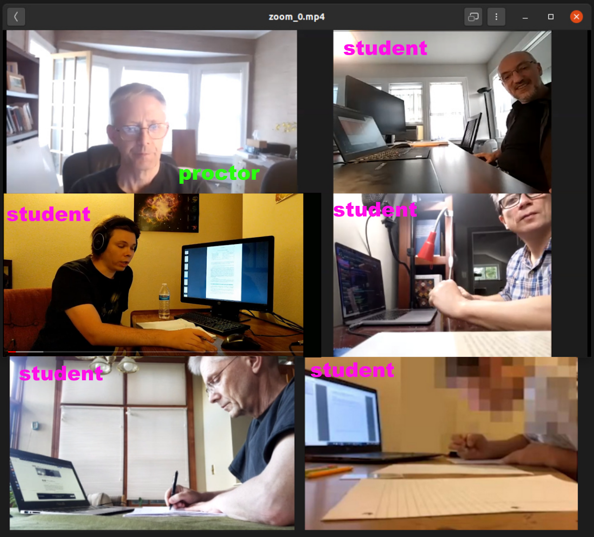

<div class="alert alert-dismissible alert-info">
  <h4 class="alert-heading">Quick links</h4>
  <ul>
  <li> <a href="/exam_guides/index.html">Math Exams Student's Guide</a> - exam instructions for students.</li>
  <li> <a href="/exam_guides/proctor.html">Math Exams Proctors's Guide</a> - exam instructions for proctors.</li>
  <li> <a href="https://exams.math.buffalo.edu/zoom"> exams.math.buffalo.edu/zoom</a> - portal for accessing exam Zoom meeings (from phone/tablet).</li>
  <li> <a href="https://exams.math.buffalo.edu"> exams.math.buffalo.edu</a> - portal for accessing exam problems (from a computer).</li>
  <li> <a href="http://blue.math.buffalo.edu/exams_next_7_days.html"> Exam meetings for the next 7 days</a>.</li>
  </ul>
</div>


<br/>
<br/>

## Introduction

This document describes procedures for administering exams remotely. These procedures are  meant to enforce academic integrity
and curtail rampant cheating that majority of our instructors experienced during the online part of the spring 2020 semester.

**Here are the  main features of this systems:**

* Live proctoring of exams in relatively small groups of up to 30 students. All groups are taking the exam in parallel during
  the designated exam time. Each group is supervised by a proctor selected from among Math Department teaching assistants.
* Using students’ smartphones as video cameras during exams. This allows for positioning cameras in a way that provides a much better  
  view of each student and his/her work environment than it is possible with webcams built into computers.
* Using an exam server for distribution of  exams to students.  The exam server can individualize exams (e.g. by watermarking them)
  and can provide access for each student to his/her copy of the exam.


<br/>

## Exam Preparation

#### Exam server

Benefits of using the Exam Server include logging exam access times, watermarking exams, and coloring of exams for easier proctoring.  
An account on the server has been created for every instructor. You log in with your UB username and password. A complete user's guide
is here: [Exam Server User's Guide](http://blue.math.buffalo.edu/nsm_exam_server.html).

The two ingredients needed to build an exam are:
* your exam pdf (or tex or docx)
* your class roster with PINs that was generated for you by the Associate Chair

With a VPN connection, upload these two files to your exams folder on the server, `yogiberra.sens.buffalo.edu`. Then log in, navigate to your exams
folder and run the watermark script:

```
watermark myexam.pdf myroster.csv
```

<br/>
It is extremely helpful to the exam proctors if the exam question paper has a strong distinctive color. This can be achieved
by adding a [hexadecimal color specification](https://htmlcolorcodes.com/){:target="_blank" rel="noopener"}:

```
watermark myexam.pdf myroster.csv color=00ffff
```
<br/>
Save and keep secret the exam password that is generated, which will look something like this:

```
Password: HWERXA
```

<br/>
To access their exam pdf, your students will go to [exams.math.buffalo.edu](https://exams.math.buffalo.edu){:target="_blank" rel="noopener"}
and enter their UBIT username, their personal exam server PIN, and the above exam password which should be kept secret until
it is delivered to the students at the moment you want them to start work on the exam.

#### UBlearns and Respondus eliminated

Live proctoring eliminates the need for Respondus Lockdown Browser and Monitor, which in turn entirely eliminates the need
to use UBlearns for the administration of exams. This greatly simplifies both the preparation process for instructors and
the access process for students, and removes our vulnerability to UBlearns service outages - which have been frequent recently.

#### Gradescope

Once the exam is completed, students will need to submit their work for grading. The recommended tool for this is Gradescope,
an online service facilitating submission and grading of student assignments.  Since many instructors used Gradescope in the spring
semester or are using it now, the students may be familiar with it already. Instructions on how to use Gradescope are available online
at [www.ubgradescope.info](https://www.ubgradescope.info){:target="_blank" rel="noopener"}.   

In order to use Gradescope for collecting exams you need to:
* create your course on Gradescope (if you have not done it already) and enroll your students in
  the course by uploading a csv course roster;
* create a Gradescope assignment for the exam;
* instruct students that they need to submit their work to Gradescope when the exam is over.

If you have not used Gradescope in your course before, it is useful to create a practice assignment before an exam, so students
can get some experience with the Gradescope submission process.

It is possible to use UBLearns, instead of Gradescope, to collect exams, but tools provided by UBLearns for exam collection and
grading are much more limited and less user friendly than what is available with Gradescope.


<br/>

## Proctoring setup

<div class="container" style="padding-left:0">
     <div class="row">
        <div class="col-lg">
        <p>During an exam students will be proctored via a Zoom meeting which they  join using the Zoom app on their phone.
        This setup offers a better view of student environment than the one provided by a camera built into their computer.</p>

        <p>For proctoring purposes, your class will be split into groups of no more than 30 students. Each group will take the exam
        in a separate Zoom meeting, with all meetings running in parallel at the same time.  Each group has a TA assigned as the proctor.
        A table of meetings occurring in the next 7 days, with the Zoom links, is maintained
        <a href="http://blue.math.buffalo.edu/exams_next_7_days.html">here</a>). The complete current list of proctoring
        assignments is available here: <a href="http://blue.math.buffalo.edu/2209_exam_proctor_schedule_rev4b.xlsx">2209_exam_proctor_schedule_rev4b.xlsx</a>
        (sort by whichever columns are relevant to you).</p>
        </div>
        <div class="col-lg">
        
       </div>
    </div>
</div>


<br/>


## Before the exam

#### Well before the exam:

* Explain to students the proctoring setup, in particular that they will need to use Zoom on their smartphones during the exam,
  and that they will need their exam server PIN to access both the Zoom meeting and the exam problems. Make sure that students
  understand that they need to:
  -  join the exam Zoom meeting from their phone or tablet using the [exams.math.buffalo.edu/zoom](https://exams.math.buffalo.edu/zoom) webpage.
  - access the exam using their computers using the [exams.math.buffalo.edu](https://exams.math.buffalo.edu) webpage. The exam password for this
    webpage will be provided to them at the beginning of the exam.   
* Refer students to the Student’s Guide for detailed instructions.

    <div class="alert alert-dismissible alert-info">
    <h5>Important:</h5>
    <ol>
    <li>The exam Zoom meetings are set up so that only UB-authenticated users can join them. This may create problems for students
    who have been using non-UB Zoom accounts. In order to avoid such issues at exam time, encourage your students to try joining
    the meeting from their smartphone days in advance of the exam via <a href="https://exams.math.buffalo.edu/zoom">https://exams.math.buffalo.edu/zoom</a>.
    Prior to the exam, they will see the meeting information and a message that the host has not yet started the meeting.</li>

    <li>Tell the students that when they will try to join the exam Zoom meeting they may see the message <em>"The host has another meeting in progress"</em>.
    This simply means that the proctor has not started the meeting yet - they should wait a few seconds and try again. </li>
    </ol>
    </div>


* Write your exam questions document, generate a pdf, and create the watermarked copies for your students using the watermark
  script on the  exam server. Make a note of the **exam password**. The password needs to be communicated to the proctors of all
  sessions so that it can be announced to the students at the moment the exam is to begin.
* When the proctoring meeting is scheduled by the Department, each proctor will receive an email from Zoom that she or he has been
  made an Alternative Host of the meeting. Detailed information for proctors on how to run a proctored meeting are specified in the
  [Proctor’s Guide](proctor.md). Information about all upcoming meetings is maintained [here](http://blue.math.buffalo.edu/exams_next_7_days.html).


#### The evening before the exam:

* Make sure that your exam is deployed on the exam server and that the portal page URL has been published to your students. You can use
  data (UBIT username and PIN) of one of the students in your course to test accessing the exam from the page
  [exams.math.buffalo.edu](https://exams.math.buffalo.edu). Also, make sure that the Gradescope assignment for students' submissions is ready.
* Remind all your proctors about the exam and ask them to be present on proctoring voice channels on the Math Department Discord server
  during the exam. In this way they will be able to communicate with other proctors and with you without the need for you to join their zoom
  meetings. Proctors should wear headphones, to reduce the chance of Discord communications being unintentionally heard by students in the Zoom
  meeting. Impress on your proctors that the responsibility for preventing cheating rests on them, and they should perform their duties actively
  and react promptly to any and all perceived improper activity.


<br/>

## During the exam

#### 15 minutes before the exam is to begin:

* Establish communication with each proctor on Discord and make sure he/she has started the Zoom meeting and has started to admit students.
  Make sure all the proctors have the exam password, and tell them to announce it to the students at the exam start time.

#### Later:

* Be present in proctoring channels of the Math Department Discord server to communicate with proctors and answer their questions.
  You may also visit the Zoom meetings to check how the exam is going.


<br/>

## After the exam

#### Gather exam data

Various pieces of data generated during the exam - video recordings, exam server access times, Zoom attendance records,
times of Gradescope submissions etc. - can be used to detect irregularities which may indicate cheating. For example,
this data can flag students who leave a proctored Zoom meeting after a few minutes, complete the exam in an unproctored setting
and then submit their work to Gradescope.

* The Associate Chair will send you a link to the Gallery View video recordings from each proctoring session, and the Zoom Meeting
  Report csv files that contain a record of every joining and leaving.
* The times when students submitted their work to Gradescope can be obtained as follows:
  - Go to your course in Gradescope.
  - On the course dashboard select the assignment with exam submissions.
  - On the assignment page click on the “Review Grades” link from the menu on the left hand side.
  - On the page with grades review click on the Download Grades button at the bottom of the page and select the “Download CSV” option.

    The CSV file you will obtain in this way will contain information with the submission time for each student. Noten that you can get this
    file even before you start grading the exam. This will not interfere in any way with your grading process.

#### Generate a time chart

Knowing when students joined and left a proctoring session, accessed the exam questions, and submitted their work, is critical
for detecting cheating. If you use the Exam Server, Zoom live-proctoring, and Gradescope, all of this information can be easily
brought together in a [chart like this](https://exams.nsm.buffalo.edu/ringland/timechart_sample_anonymized.svg) that allows rapid detection
of anomalies. Line segments denote presence in the Zoom meeting, blue (or magenta) squares are accesses to exam server (should not be outside
Zoom meeting), and green (or red) dots are Gradescope submissions.

To create such a chart:

* Upload your Gradescope gradesheet (pre-grading version is fine) and the Zoom meeting reports (`participants_blah.csv`) to the folder containing
  the student exam pdfs on the Exam Server.
* Run the timechart script:

  ```
  chart examfolder
  ```

  <br/>
  
  The chart in SVG format will be generated in the exam folder and a URL to it will be provided. See exam server guide for more details and options.
  If you need help with this, contact John Ringland.


<br/>

## Grading

Grade the collected exams in the way you prefer. Gradescope allows for exportable logging of submission times, rapid paging through submissions
for each problem separately, simultaneous grading by several graders, reusable rubrics, automated score computations, and provides an easy way to
return graded exams to students.
