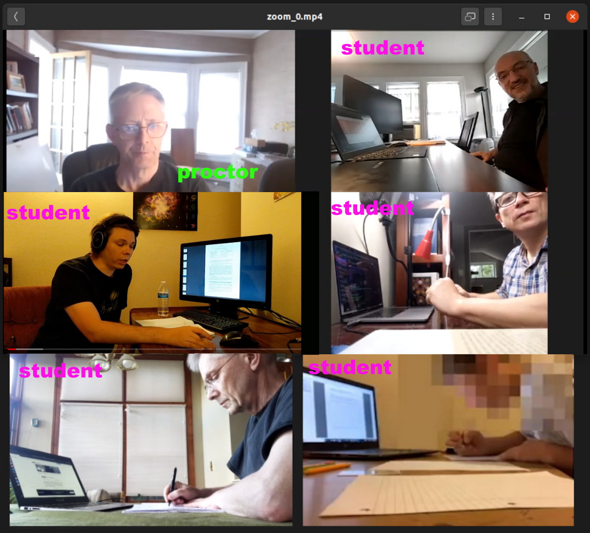
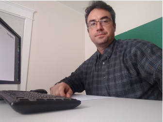
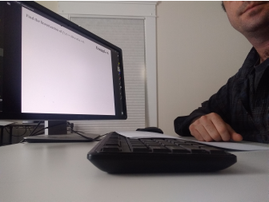

  <h4 class="alert-heading">Quick links</h4>
  <ul>
    <li> <a href="/index.html">Math Exams Student's Guide</a> - exam instructions for students.</li>
    <li> <a href="https://exams.math.buffalo.edu/zoom"> exams.math.buffalo.edu/zoom</a> - portal for accessing exam Zoom
      meeings (from phone/tablet).</li>
    <li> <a href="https://exams.math.buffalo.edu"> exams.math.buffalo.edu</a> - portal for accessing exam problems (from
      a computer).</li>
    <li> <a href="http://blue.math.buffalo.edu/exams_next_7_days.html"> Exam meetings for the next 7 days</a>.</li>
  </ul>

 
 

## Our goal: remote exams with integrity

With remote exams there are many opportunities for cheating. Our goal is to conduct remote exams which have integrity.
Respondus Monitor had been found not effective in preventing cheating.
**2-device live-proctored exams** have the potential to be effective.

 

## Proctoring assignments

A table with Zoom links of meetings occurring in the next 7 days is maintained
[here](http://blue.math.buffalo.edu/exams_next_7_days.html){:target="_blank" rel="noopener"},
and the complete list of current proctoring assignments is here:
[ http://blue.math.buffalo.edu/2211_exam_proctor_schedule_rev6.xlsx](http://blue.math.buffalo.edu/2211_exam_proctor_schedule_rev6.xlsx){:target="_blank"
rel="noopener"}.

 

## 2-device exam setup

  

    

      

      Students join exam Zoom meetings from their phone with video on while accessing exam questions through their
      computers.
      Proctors monitor students by watching the video streams from students' phone cameras.
      

    

    

      
    

  

 

## Preparation for proctoring

There are two pieces of information that you will need before an exam in order to proctor it:

* **A link to the exam Zoom meeting.** These meetings are centrally scheduled by the Math Department - proctors do not
schedule these meetings.
When a meeting you are assigned to proctor is scheduled, you will receive an email from Zoom informing you that you have
been made
an Alternative Host of the meeting. You can also find the link to this meeting here.
* **The exam password.** You will need to announce this password to students, so that they can access exam questions.
The password should be provided to you by the instructor of the course for which you are proctoring, ahead of the exam.

In addition, you should have access to the Math Department Discord Server, which will be used for communications
between proctors of various exam sessions and the course instructor during the exam. If you don't have access to this
Discord server contact John Ringland, the Associate Chair (ringland@buffalo.edu). Before you proctor an exam please also
review the Exam Guide for Students so you are familiar how the exam is supposed to look from a student perspective.

 

#### Zoom configuration

Most settings of exam Zoom meetings are automatically set when a meeting is scheduled.
However, the setting for recording of the meeting must be configured in your own account in order to work correctly:

1. Use the web browser interface for Zoom ([buffalo.zoom.us](https://buffalo.zoom.us){:target="_blank" rel="noopener"})
to log in to your UB Zoom account.
2. In the Zoom account click on Settings and then on the **Recording** tab.
3. Turn ***Cloud Recording*** **ON**.
4. Make sure that the ***Record active speaker, gallery view and shared screen separately*** option is **SELECTED**.
5. Under this option make sure that:
- ***Active speaker*** is **UNSELECTED**
- ***Gallery view*** is **SELECTED**
- ***Shared screen*** is **UNSELECTED**.

The image below shows the correct recording configuration.

 

## Starting a proctoring meeting

* Start the Zoom meeting at least 15 minutes prior to the start of the exam (20 if possible).

* Once you start the meeting confirm that meeting settings are correct and adjust them if needed:
  - [Security](assets/images/zoom_security.png){:target="_blank" rel="noopener"}:
    * Lock Meeting - **UNCHECKED**
    * Enable Waiting Room - **CHECKED**
    * Share screen - **UNCHECKED**
    * Chat - **CHECKED**
    * Rename Themselves - **UNCHECKED**
  - [Chat → … → Participant can chat](assets/images/zoom_chat.png){:target="_blank" rel="noopener"}: **with host only**
  - [Video settings](assets/images/zoom_video.png){:target="_blank" rel="noopener"}:
    * Always display participant name on their video - **CHECKED**
    * Hide non-video participants - **UNCHECKED**  - <b>this is critical!</b>
 

*  Make sure that the meeting is being recorded. If not, start the recording in the cloud.

* In the Math Dept Discord Server go to the proctoring suite corresponding to your exam and join one of the voice channels
  so that your presence is visible. Post a message in the text channel of the proctoring suite that you started the meeting.

  <b>Note.</b>

  
1. When you start a meeting you may see a pop-up box with the message "You have a meeting currently
  in-progress.
  Please end it to start a new meeting". This message is due to the way exam Zoom meetings are scheduled. Click on the
  "End Other Meeting" button.
  

  
2. It is recommended that you use headphones during the exam to reduce the chance of accidentally letting
  students hear Discord communication. Keep yourself muted in Zoom except when you are deliberately talking to students.
  

 

## Admitting students to the meeting

**Admit students from the waiting room in small groups.** If you are using a Windows or a Mac computer,
you can reorder Zoom videos by dragging them in such way that all videos coming before your own will
be of students whose IDs have been checked already. In this way it will be easier to keep track who still needs to be
checked.

**For each admitted student check their UB ID** (a government issued photo ID is acceptable as well):
* Compare the photo in the ID with student's face.
* Compare the name in the ID with the name displayed in Zoom.
* In case of irregularities - name mismatch, no ID etc. make a note in the proctoring text channel on Discord.

 

  <h2>Students' camera views</h2>
  
 As you are admitting students to the exam, and also during the exam itself, make sure that students'
    cameras are positioned correctly. Instruct students to make adjustments as needed.

   
  

    

      

        <h4>Zoom device setup</h4>
        
Students should use the front-facing (selfie) camera for the Zoom meeting (so that the screen is
          facing towards them). The device must be positioned in the landscape mode and placed about 4 ft (120 cm) away
          from your work area and about 10 inches (20 cm) above the work surface. It must receive a clear view
          of:

        <ul>
          <li> the computer screen and keyboard (and mouse if any) </li>
          <li> student's face and and hands </li>
          <li> student's entire writing surface. </li>
        </ul>
        

      

      

        
      

    

     

    

      

        <h4>Correct camera view</h4>
        
This is how that the view from a camera should look. The student, the work surface, and the computer screen
          are clearly visible.

      

      

        
      

    

  

   

  <h4>Examples of incorrect camera views</h4>
  
Most of the issues illustrated below can be fixed if the student places the camera further away from themselves.

  

    

      
      

        
&#9888; Work surface not visible.

      

    

    

      
      

        
&#9888; Camera too close.

      

    

    

      
      

        
&#9888; Part of the computer screen not
          visible.

      

    

    

      
      

        
&#9888; Face not visible.

      

    

    

      
      

        
&#9888; Computer screen not in the
          picture.
        

      

    

    

      
      

        
&#9888; Video oriented vertically. To
          fix
          this, pick up the phone, wave it around a bit, and set it back down.

      

    

    

      
      

        
&#9888; Camera oriented vertically,
          partial
          view of the monitor and work surface only.

      

    

    

      
      

        
&#9888; Headphones/earbuds are not
          allowed.
        

      

    

  

 

## During the exam

#### Starting the exam

* **Immediately before the exam starts** announce what the exam checkout procedure is (see below).
* **Announce the exam password.** This will let the students access the exam from their computers through
the website [exams.math.buffalo.edu](https://exams.math.buffalo.edu) and start working on the exams.

#### Once the exam has started

  

    

      

      <ul>
        <li> Keep an eye on the waiting room for late-comers or students who drop out from the meeting and return.
          Anyone entering from the waiting room needs to have their ID checked (or re-checked). If you notice
          a student who dropped from the meeting and re-entered make a note in the Discord text channel.</li>
        <li> Enforce video-on for all students throughout the exam. If a student's video is off, and they do not
          properly
          respond to request(s) to turn it on, remove them from the meeting and make a record that you did it in
          Discord.</li>
        <li> Be sure to keep your audio muted except when you need to speak to students.</li>
        <li>If any student’s video does not show everything you need to see, have them correct it.</li>
        <li>If a student is willfully or repeatedly not complying with your instructions, let them know that if they do
          not
          comply within the next minute, they will be ejected from the meeting and get a 0 on the exam. If you do eject
          anyone,
          make a note in Discord.</li>
        <li> Monitor students carefully. Be on the alert for any form of cheating and actively communicate with students
          to correct
          any irregularities. Pin student's video for a closer view if needed.</li>
      </ul>
      

    

    

      

        <h5>Red flags:</h5>
        <ul>
          <li> student is typing </li>
          <li> student is scrolling a lot </li>
          <li> student is looking at different documents on their computer </li>
          <li> student is looking repeatedly at the Zoom camera (i.e. their phone) </li>
          <li> student is looking repeatedly at any location other than computer screen or paper </li>
          <li> student appears to be talking </li>
          <li> student is wearing earbuds/headphones (not allowed) </li>
          <li> student is using a virtual background (not allowed). </li>
        </ul>
         
        
<b>In case of any suspicious behavior</b> make a note of the issue in the text channel of Discord.
          Communicate with the student either verbally or in the Zoom chat - as appropriate. In case of text chat, inform
          the student that they should check their chat messages.

      

    

  

 

## Exam checkout

* Students should use the Raise Hand feature to signal that they are ready to leave the exam. When you notice it,
tell the student to show exam pages to the camera one by one. The student should position the camera over
a stack of pages and remove pages one by one stopping for about one second for each page.
Here is a [short
video](https://ub.hosted.panopto.com/Panopto/Pages/Viewer.aspx?id=1665fd0d-3d0a-4c76-9049-ac5b00e8a2da){:target="_blank"
rel="noopener"}
demonstration of this process.

* Once a student shows all exam pages tells the student that they may leave the Zoom meeting and upload their work
to Gradescope, UBLearns or use a different submission method specified by the course instructor.

**Note:** If there are several students waiting to be checked out, acknowledge that you see them by
making an announcement that they will be checked out shortly.

When all students leave the Zoom meeting, close the meeting. Your duties are finished!
