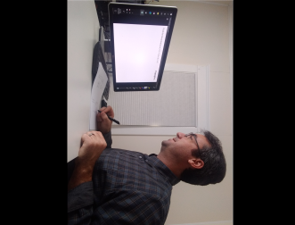
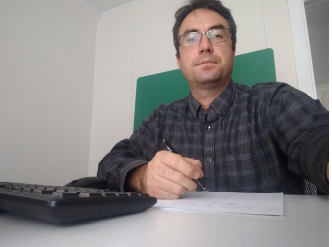

  <h4 class="alert-heading">Quick links</h4>
  <ul>
  <li> <a href="/exam_guides/index.html">Math Exams Student's Guide</a> - exam instructions for students.</li>
  <li> <a href="https://exams.math.buffalo.edu/zoom"> exams.math.buffalo.edu/zoom</a> - portal for accessing exam Zoom meeings (from phone/tablet).</li>
  <li> <a href="https://exams.math.buffalo.edu"> exams.math.buffalo.edu</a> - portal for accessing exam problems (from a computer).</li>
  <li> <a href="http://blue.math.buffalo.edu/exams_next_7_days.html"> Exam meetings for the next 7 days</a>.</li>
  </ul>

 
 

## Our goal: remote exams with integrity

With remote exams there are many opportunities for cheating. Our goal is to conduct remote exams which have integrity.  
Respondus Monitor had been found not effective in preventing cheating.
**2-device live-proctored exams** have the potential to be effective.

 

## Proctoring assignments

A table with Zoom links of meetings occurring in the next 7 days is maintained [here](http://blue.math.buffalo.edu/exams_next_7_days.html){:target="_blank" rel="noopener"},
and the complete list of current proctoring assignments is here: [2209_exam_proctor_schedule_rev6d_public.xlsx](http://blue.math.buffalo.edu/2209_exam_proctor_schedule_rev6d_public.xlsx){:target="_blank" rel="noopener"}.

 

## 2-device exam setup

     

        

        Students join exam Zoom meetings from their phone with video on while accessing exam questions through their computers.
        Proctors monitor students by watching the video streams from students' phone cameras.
        

        

        
       

    

 

## Preparation for proctoring

There are two pieces of information that you will need before an exam in order to proctor it:

* **A link to the exam Zoom meeting.** These meetings are centrally scheduled by the Math Department - proctors do not schedule these meetings.  
  When a meeting you are assigned to proctor is scheduled, you will receive an email from Zoom informing you that you have been made
  an Alternative Host of the meeting. You can also find the link to this meeting  here.
* **The exam password.** You will need to announce this password to students, so that they can access exam questions.  
  The password should be provided to you by the instructor of the course for which you are proctoring, ahead of the exam.

In addition, you should have access to the Math Department Discord Server, which will be used for communications
between proctors of various exam sessions and the course instructor during the exam. If you don't have access to this
Discord server contact John Ringland, the Associate Chair (ringland@buffalo.edu). Before you proctor an exam  please also
review the Exam Guide for Students so you are familiar how the exam is supposed to look from a student perspective.

 

#### Zoom configuration

Most settings of exam Zoom meetings are automatically set when a meeting is scheduled.
However, the setting for recording of the meeting must be configured in your own account in order to work correctly:

1. Use the web browser interface for Zoom ([buffalo.zoom.us](https://buffalo.zoom.us){:target="_blank" rel="noopener"})
   to log in to your UB Zoom account.
2. In the Zoom account click on Settings and then on the **Recording** tab.
3. Turn ***Cloud Recording*** **ON**.
4. Make sure that the ***Record active speaker, gallery view and shared screen separately*** option is **SELECTED**.
5. Under this option make sure that:
   - ***Active speaker*** is **UNSELECTED**
   - ***Gallery view*** is **SELECTED**
   - ***Shared screen*** is **UNSELECTED**.

The image below shows the correct recording configuration.

 

## Starting a proctoring meeting

1. Start the Zoom meeting at least 15 minutes prior to the start of the exam (20 if possible).

    

    <b>Note.</b> When you start a meeting you may see a pop-up box with the message "You have a meeting currently in-progress.
    Please end it to start a new meeting". This message is due to the way exam Zoom meetings are scheduled. Click on the "End Other Meeting" button.
    

2. Once you start the meeting confirm that meeting settings are correct and adjust them if needed:
   - [Security](assets/images/zoom_security.png):  
     * Lock Meeting - **UNCHECKED**
     * Enable Waiting Room - **CHECKED**
     * Share screen - **UNCHECKED**
     * Chat - **CHECKED**
     * Rename Themselves - **UNCHECKED**
   - [Chat  → …  → Participant can chat](assets/images/zoom_chat.png): **with host only**
   - [Video settings](assets/images/zoom_video.png):
     * Always display participant name on their video - **CHECKED**
     * Hide non-video participants  - **UNCHECKED**   - <b>this is critical!</b>

3. Make sure that the meeting is being recorded. If not, start the recording in the cloud.

4. Go to the Proctoring Room in the Math Dept Discord Server whose number corresponds to your meeting number.
   Use Suite B if Suite A is already in use for a different exam. Post a message in the corresponding text channel that you started the meeting.

   

   <b>Note.</b> It is recommended that you use headphones during the exam to reduce the chance of accidentally letting students
   hear Discord communication. Keep yourself muted in Zoom except when you are deliberately talking to students.
   

 

## Admitting students to the meeting

**Admit students from the waiting room in small groups.** If you are using a Windows or a Mac computer,
you can reorder Zoom videos by dragging them in such way that all videos coming before your own will
be of students whose IDs have been checked already. In this way it will be easier to keep track who still needs to be checked.

**For each admitted student check their UB ID** (a government issued photo ID is acceptable as well):
* Compare the photo in the ID with student's face.
* Compare the name in the ID with the name displayed in Zoom.
* In case of irregularities - name mismatch, no ID etc. make a note in the proctoring text channel on Discord.

 As you are admitting students to the exam,  and also during the exam itself, make sure that students'
cameras are positioned correctly. Instruct students to make adjustments as needed.

 

     

        

        <h4>Correct camera view</h4>
        
This is how that the view from a camera should look. The student, the work surface, and the computer screen are clearly visible.

       

       

        
       

    

 

<h4>Examples of incorrect camera views</h4>

  

    
    

      
&#9888; Work surface not visible.

    

  

  

    
    

      
&#9888; Camera too close.

    

  

  

    
    

      
&#9888; Part of the computer screen not visible.

    

  

  

    
    

      
&#9888; Camera oriented vertically, partial view of the monitor and work surface only.

    

  

  

    
    

      
&#9888; Face not visible.

    

  

  

    
    

      
&#9888; Video oriented vertically.  To fix this, pick up the phone, wave it around a bit, and set it back down.

    

  

  

    
    

      
&#9888; Computer screen not in the picture.

    

  

  

    
    

      
&#9888; Headphones/earbuds are not allowed.

    

  

 

## Taking the exam.

#### 1. Join the Zoom proctoring meeting

1. Prepare your UB student ID - you will need to show it to the proctor when you get admitted to the exam Zoom meeting.

2. Join the Zoom meeting on your smartphone by going to the page [exams.math.buffalo.edu/zoom](https://exams.math.buffalo.edu/zoom){:target="_blank" rel="noopener"}
   and entering your UBIT name and your personal PIN for the course. You need to be signed into Zoom using your UB Zoom account.
   You should be in the Zoom meeting about 10 minutes prior to the start of the exam, so the proctor can check you in before the exam begins.  

    

    <b>Note.</b> When you try to join the meeting you may see the message "The host has another meeting in progress.".
    This simply means that the proctor has not started the meeting yet - wait a moment and try again.
    

3. Set your Zoom device to use the front-facing (selfie) camera.

4. Turn the video on, the speaker on and volume loud enough so that you can hear the proctor, but not so loud that you will be disturbed
   by occasional verbal interactions of the proctor with other students during the exam. Turn your microphone off (you can unmute yourself
   temporarily if you need to talk to the proctor).

#### 2. Follow the proctor's instructions

1. Position your Zoom device as described above in Zoom Device Setup.
2. Follow any additional instructions from the proctor.

#### 3. Access the exam questions

1. On your computer, in a web browser, access the following  URL: [exams.math.buffalo.edu](https://exams.math.buffalo.edu){:target="_blank" rel="noopener"}.
2. Enter your UBIT username and the exam PIN, and wait for the proctor to announce the exam password.
3. Enter the exam password, click Go to access the exam questions, and begin work on the exam.

#### 4. Answer the exam questions

* **One-side only:** write your solutions on blank sheets of paper using one side of the paper only.
* **Question numbers:** clearly label your work with the corresponding question number.
* **Space between questions:** leave some blank space between your work for different questions (~3cm).
* **Space for ID:** leave an empty spot on each page where you will place your Photo ID when taking pictures of your work for submitting them to Gradescope.
* **One Page:** for each question, write all of your answer on the same page if possible:
    * If you are unsure your solution will fit in the remaining space on the current page, start the problem on a new page.
    * In the case where multiple pages of work are needed, clearly indicate that your solution is continued on another page.

#### 5. Checkout

Once you are finished answering the questions:

1. Make a stack of all pages of your work in preparation for showing them to the Zoom device.
2. Use the raise hand feature to let the proctor know that you are ready to leave the exam, and wait for the proctor to call upon you.
3. Move your Zoom device directly over your stack of pages, and repeatedly remove the top page until you've shown the whole stack.
   Pause on each page for about 1 second, so the camera can focus.
4. When you have completed this procedure,  leave the Zoom meeting and proceed to Step 6.

Here is a [short video](https://ub.hosted.panopto.com/Panopto/Pages/Viewer.aspx?id=1665fd0d-3d0a-4c76-9049-ac5b00e8a2da){:target="_blank" rel="noopener"} demonstrating the checkout process.

<b>Important.</b> The following behavior will considered an act of Academic Dishonesty with serious consequences
(such as an F on the exam or a course failure):

  <ul>
  <li> Leaving the Zoom meeting without checking out. </li>
  <li> Uploading to Gradescope any page that was not shown to the Zoom Device during checkout or was subsequently altered. </li>
  </ul>

#### 6. Submit your work to Gradescope

Once you exit the Zoom Proctoring Session you will have 10 minutes to upload a single PDF file of your work to Gradescope.
Exams will not be accepted after this deadline. **Do not write or alter anything on your pages once you leave the Zoom proctored meeting.**

1. Scan all the pages of your work using the Office Lens app, and convert to a **single PDF** file.
   **Place your Photo ID on an empty section of each page, so that both your work and the ID are visible in each picture.**
2. Upload the PDF file to Gradescope. (It may be easier if you email the file to yourself first, and then use your computer to go through the upload process.)
3. Make sure that you match each page of your work with the corresponding question on Gradescope.

Here is a [short video](https://ub.hosted.panopto.com/Panopto/Pages/Viewer.aspx?id=1150706c-3572-452e-b34f-ac5b0149af2f){:target="_blank" rel="noopener"}
demonstrating the process of uploading your work to Gradescope and matching pages with questions. You can also read the information
[here](https://www.ubgradescope.info/){:target="_blank" rel="noopener"} .

 

## Viewing graded exams

To check your exam score, log in to Gradescope and click on a course tile. This will bring you to a page with a list of assignments for this course. Assignments which have been already graded will show your score in the Status column.

1. Click on the assignment to see the score for each question.
2. Click on each assignment question to see any comments from the grader.

 

## Respondus Lockdown Browser

Some instructors may choose to allow you to access the exam only via Respondus Lockdown Browser.
If your course instructor tells you that this is the case,
install the Respondus LockDown Browser on your computer. You need to use the installer link below,
as it will install the version of Respondus that has been
preconfigured to work with UBLearns.

* [Installer](https://download.respondus.com/lockdown/download.php?id=231516053){:target="_blank" rel="noopener"} (this will start the installation process).
* [Instructions from UBIT](http://www.buffalo.edu/ubit/service-guides/teaching-technology/learning-resources-for-students/ublearns/respondus.html){:target="_blank" rel="noopener"}.

**Note:**  
* Even if you have installed Respondus on your computer in the past (possibly for the ALEKS exam),
  you need to re-install using the link above.
* Respondus only runs on Mac OS and Windows. It cannot be used on Chrome OS or Linux distributions.
